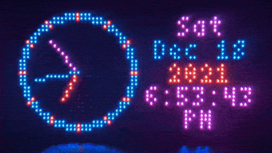
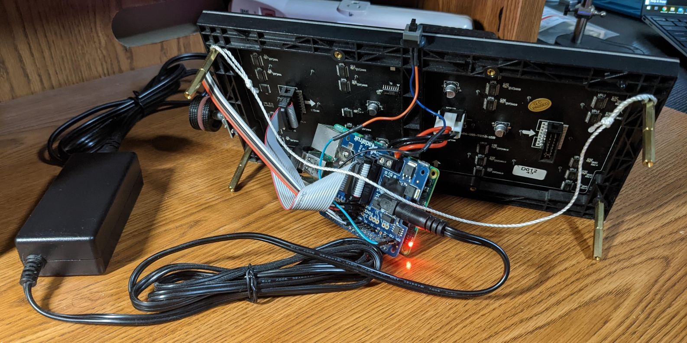
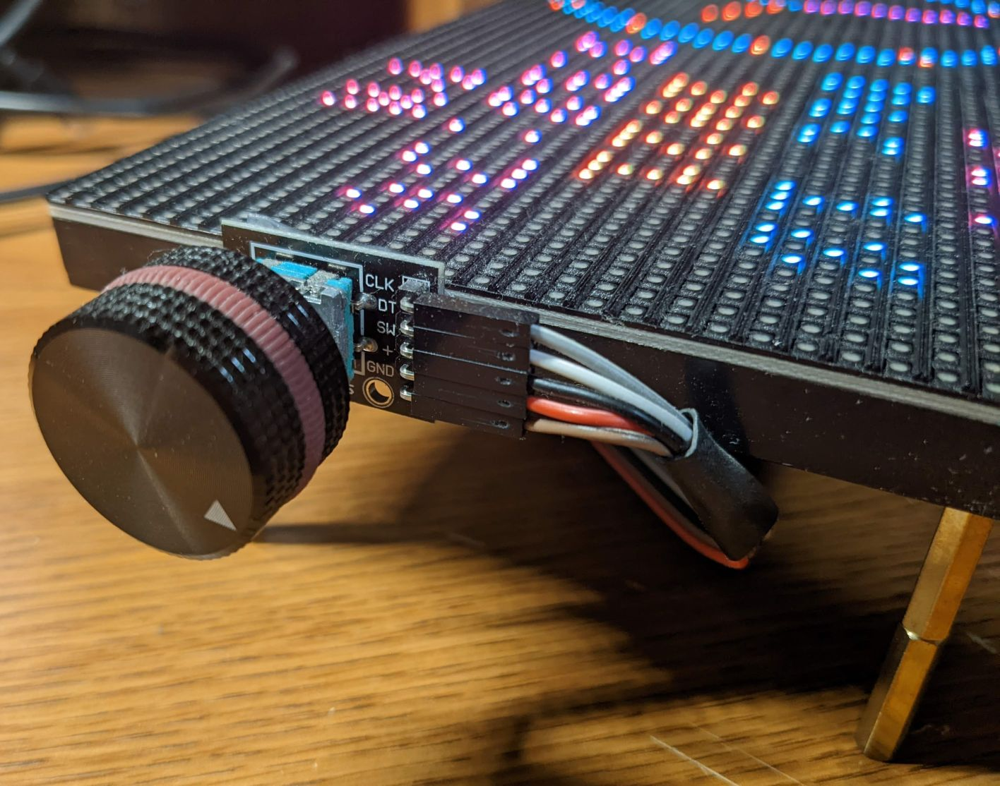
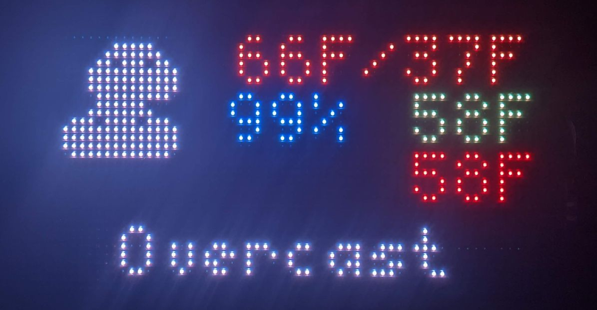
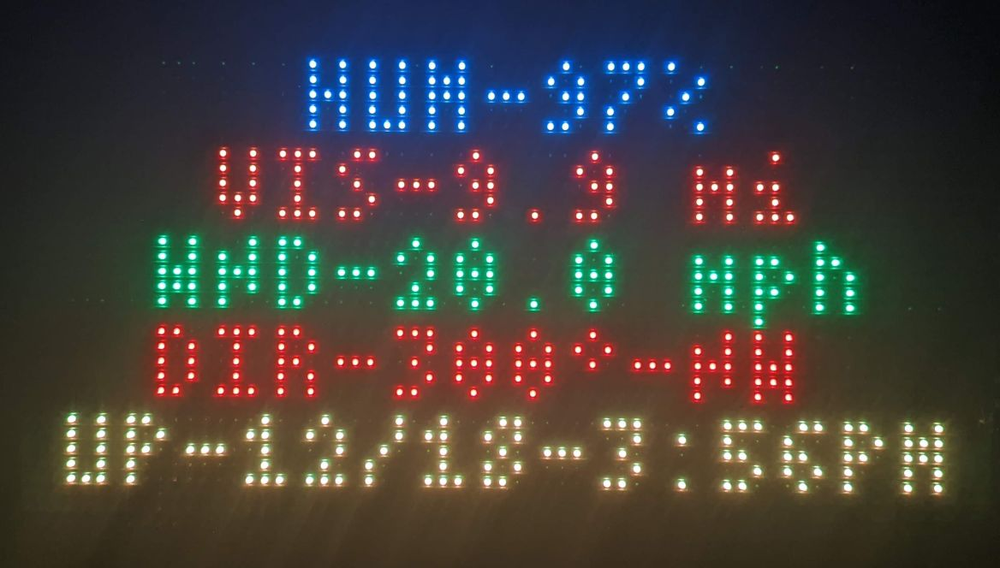
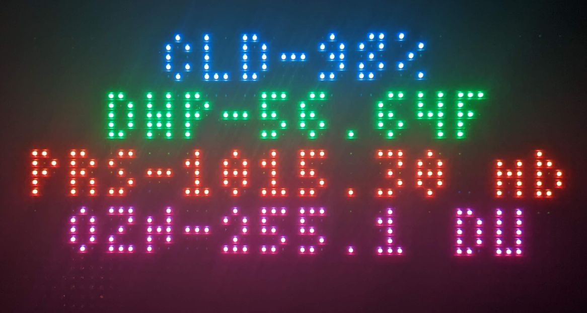
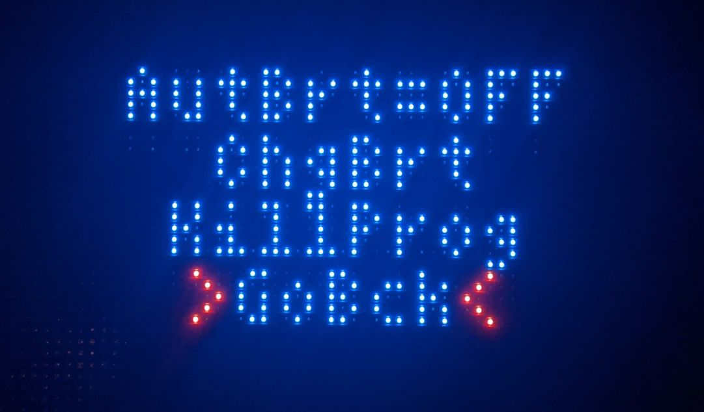

# rpi-weather-matrix
Raspberry Pi driven RGB LED matrix display with weather, clock, &amp; more.

# Demo
<p align="center">
    
</p>

# Hardware
<p align="center">
    
</p>

Components:
- Raspberry Pi 2B
- [64x32 RGB LED Matrix](https://www.adafruit.com/product/2278)
- [RGB Matrix HAT + RTC](https://www.adafruit.com/product/2345)
- Rotary Encoder Module (Search eBay or similar)
- Pushbutton with wires (Salvaged from old PC case)
- 5V 4A power supply with barrel jack
- USB Bluetooth Adapter (For PS3 controller experiments)
- USB Wi-Fi Adapter

# Software
The main program was written in C++, using the wonderful [rpi-rgb-led-matrix](https://github.com/hzeller/rpi-rgb-led-matrix) library.
I wrote a custom library in C++ to read the rotary encoder connected to some GPIO pins on the Pi. I followed the approach detailed in this [blog](http://www.buxtronix.net/2011/10/rotary-encoders-done-properly.html). This code runs in a separate thread from the main program using [pthreads](https://en.wikipedia.org/wiki/Pthreads).

The weather data was pulled using the [Dark Sky](https://darksky.net) API. Dark Sky was recently acquired by Apple and the API will stop working at the end of 2022. I used Python to handle the API request, process the data, and write the data into a simple text file that can be easily read by the main C++ program. I used Unix [signals](https://en.wikipedia.org/wiki/Signal_(IPC)) for communication between the Python and C++ processes.

Changes made to the root [crontab](https://en.wikipedia.org/wiki/Cron) for process automation:
```sh
# Get VOTD each day at 4:30 AM
30 4 * * * cd /home/pi/matrix/py/; ./get_verse.py &
#
# Get weather data every 2 min during the hours of 4AM - 10PM
*/2 04-22 * * * cd /home/pi/matrix/py/; ./get_darksky.py &

# Clear weather log each day at midnight
@daily rm /home/pi/matrix/out/weather_log.txt
```
The HMI consists of the rotary encoder on the side of the matrix and a pushbutton on top. Turning the rotary encoder allows you to switch between different screens/options. You can make a selection by pressing in on the encoder. One screen is black so the matrix can be turned off if desired. Pressing the pushbutton on top will cause the Pi to safely power down. When the Pi is powered off, pressing the button again will power it up.

Below you can see the various screens created for the matrix. Many weather parameters are displayed with a colorful interface.

<p align="center">
    
</p>
<p align="center">
    
</p>
<p align="center">
    
</p>

# Useful Links
http://www.buxtronix.net/2011/10/rotary-encoders-done-properly.html  
