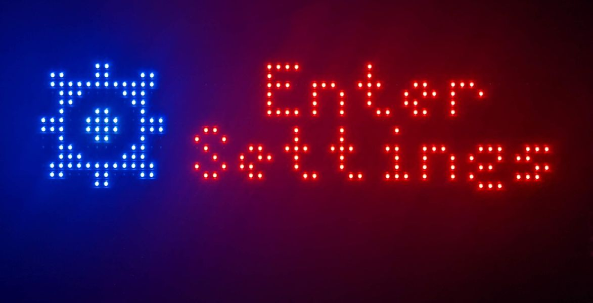
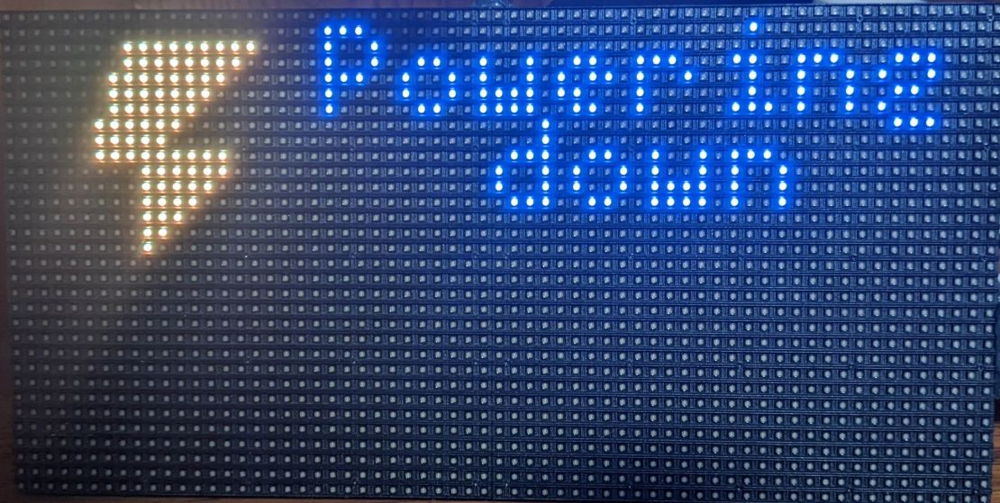

# rpi-weather-matrix
Raspberry Pi driven RGB LED matrix display with weather, clock, &amp; more.

# Demo

    

# Hardware

    

Components:
- Raspberry Pi 2B
- [64x32 RGB LED Matrix](https://www.adafruit.com/product/2278)
- [RGB Matrix HAT + RTC](https://www.adafruit.com/product/2345)
- Rotary Encoder Module (Search eBay or similar)
- Pushbutton with wires (Salvaged from old PC case)
- 5V power supply with barrel jack
- USB Bluetooth Adapter (For PS3 controller experiments)
- USB Wi-Fi Adapter

# Software

    

    

    

